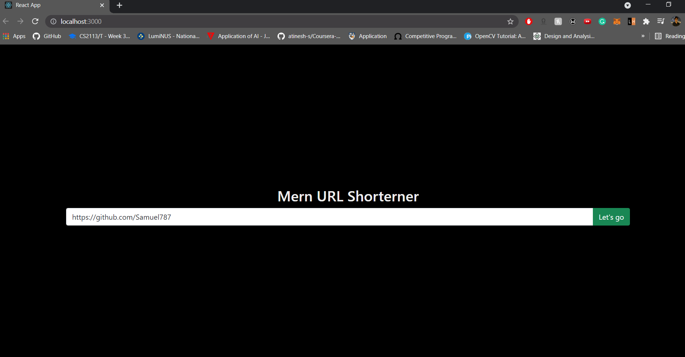
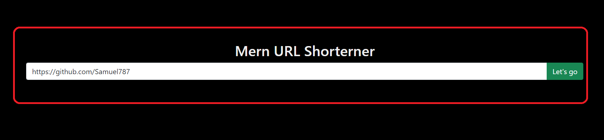
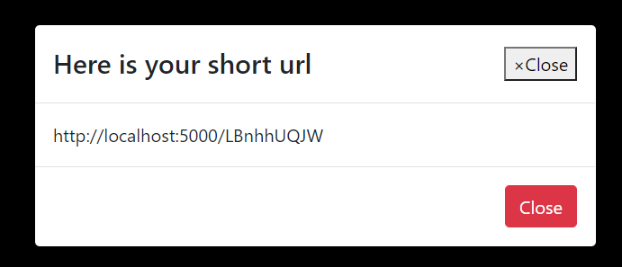
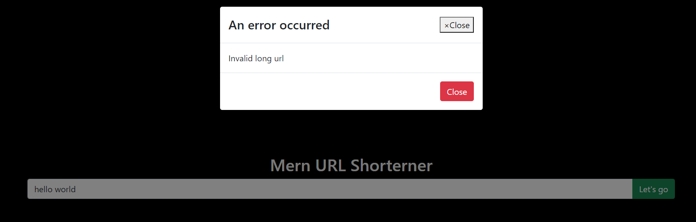
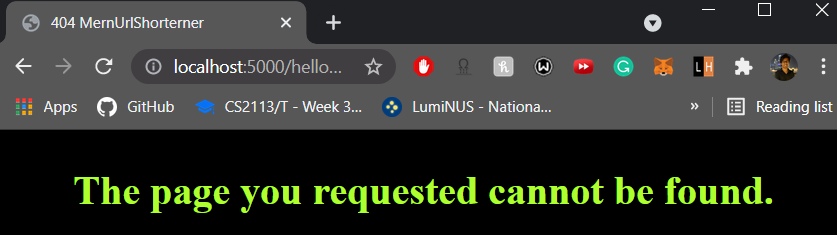

# MernUrlShorterner

An URL Shorterner developed using MERN Stack


## Setting up

1. Clone the project into a local directory by running the following command in that dir:
   `https://github.com/Samuel787/MernUrlShorterner.git`
2. MongoDB Atlas was used to host the MongoDB remotely. Access is granted for all IP addresses. If you require access to view the database, please contact me at: sdsamuel@u.nus.edu
3. Since this project was created with Node.js, Node is required. Install the latest version of node and npm: https://nodejs.org/en/
4. Run `npm install` in `/server` to install all the required dependencies for node server
5. Run `npm install` `in /client` to install all the required dependencies for web client
6. To start the server run the following command in the `/server` directory:
   `$ npm start`
   The server will run on port 5000 upon starting successfully.
7. To start the client, run the following command in the `/client` directory:
   `npm start`
   This will open up the client web page on your browswer.

## Requirement 1 - REST API backend

1. The back-end (REST API) server will:
   - return a short URL when given a specified URL (only if the URL is valid)
   - redirects to the specified URL when given a short URL
   - redirects to 404 page if the shortened URL is invalid
2. API to shorten url: `http://localhost:5000/api/url/shorten` in this format:

```javascript
method: "POST",
headers:  {
    "Accept": "application/json",
    "Content-type": "application/json",
},
body: JSON.stringify({
    "longUrl": LONG_URL_GOES_HERE
})
```

3. API to redirect to shortened url: `http://localhost:5000/<SHORT_CODE>`

## Requirement 2 - Front End

1. A simple front end is developed for users to easily interact with the API as shown in the app preview image at the start of the document.

2. Users can input the long url in the input field in red and press the green "Let's go button" in order to get the shortened URL.
   
3. Upon clicking "Let's go", one of the following will happen:
   3.1. If the long url is valid, the backend will generate a new shortened url if it has never seen this url before or return the shortened url if it has shortened it before. The shortened url will be presented to the user like this:
   
   3.2. If the long url was invalid, the following will be displayed to the user:
   
4. The user can also use the short url while the server is running by entering the shortened url in their browser and it will redirect to the correct page.
   > :exclamation: The server has to be running locally on port 5000
5. If an invalid shortened url is provided, the user will be redirected to a custom 404 page as shown below
   

### Hope you enjoy using the URL shorterner :smile:
